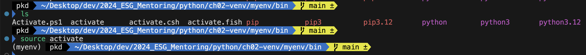
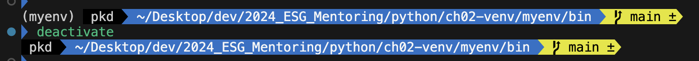
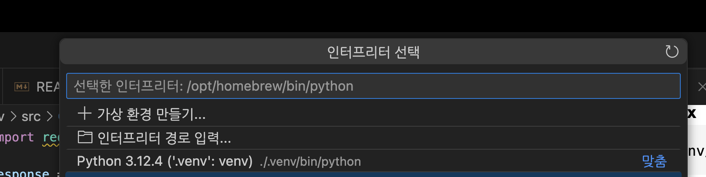
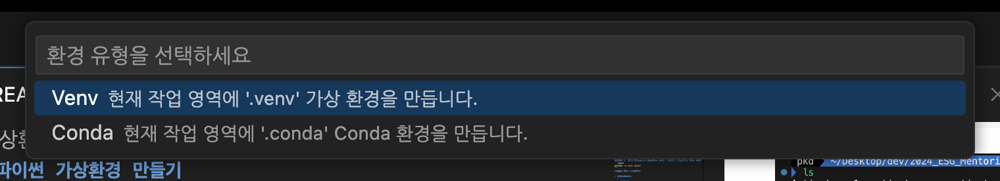
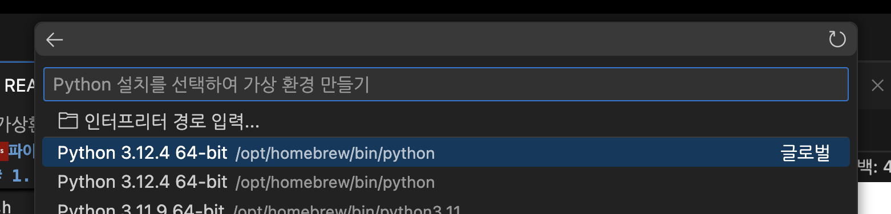

#### 파이썬 가상환경 만들기
###### 1. 콘솔(터미널)로 가상환경 직접 만들어서 명령어로 환경 설정
```bash
python -m venv myenv
```
**가상 환경 활성화**

- **Windows**
    
    ```bash
    myenv\Scripts\activate
    ```
    
- **MacOS/Linux**
    
    ```bash
    source myenv/bin/activate
    ```
    


**가상 환경 비활성화**

```bash
deactivate
```


###### 2. VScode 프로젝트 현재 경로에서 가상환경 만들기
**하단 파이썬 버전 클릭**

**가상환경 만들기**



